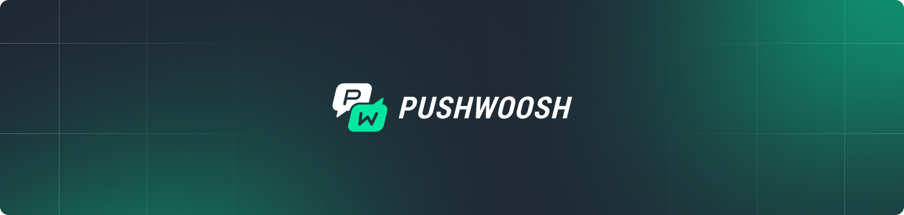

<p align="center">
  <a href="https://docs.pushwoosh.com/developer/pushwoosh-sdk/cross-platform-frameworks/cordova/">
    
  </a>
</p>

<h1 align="center">Pushwoosh Cordova Plugin</h1>

<p align="center">
  <a href="https://github.com/Pushwoosh/pushwoosh-phonegap-plugin/releases"></a>
  <a href="https://www.npmjs.com/package/pushwoosh-cordova-plugin"></a>
  <a href="https://www.npmjs.com/package/pushwoosh-cordova-plugin"></a>
</p>

<p align="center">
  Cross-platform push notifications, In-App messaging, and more for Cordova / PhoneGap applications.
</p>

## Table of Contents

- [Documentation](#documentation)
- [Features](#features)
- [Installation](#installation)
- [AI-Assisted Integration](#ai-assisted-integration)
- [Quick Start](#quick-start)
- [API Reference](#api-reference)
- [Plugin Preferences](#plugin-preferences)
- [Huawei (HMS) Setup](#huawei-hms-setup)
- [Support](#support)
- [License](#license)

## Documentation

- [Integration Guide](https://docs.pushwoosh.com/platform-docs/pushwoosh-sdk/cross-platform-frameworks/cordova/integrating-cordova-plugin) — step-by-step setup
- [API Reference](https://docs.pushwoosh.com/platform-docs/pushwoosh-sdk/cross-platform-frameworks/cordova/cordova-plugin-api-reference) — full API documentation

## Features

- **Push Notifications** — register, receive, and handle push notifications on iOS and Android
- **In-App Messages** — trigger and display in-app messages based on events
- **Tags & Segmentation** — set and get user tags for targeted messaging
- **User Identification** — associate devices with user IDs for cross-device tracking
- **Message Inbox** — built-in UI for message inbox with customization options
- **Badge Management** — set, get, and increment app icon badge numbers
- **Local Notifications** — schedule and manage local notifications
- **VoIP Calls** — CallKit (iOS) and ConnectionService (Android) integration for VoIP push calls
- **Huawei Push** — HMS push notification support
- **TypeScript Support** — full TypeScript definitions included

## Installation

Using npm:

```bash
cordova plugin add pushwoosh-cordova-plugin@8.3.78
```

Using git:

```bash
cordova plugin add https://github.com/Pushwoosh/pushwoosh-phonegap-plugin.git#8.3.78
```

### Requirements

The Pushwoosh iOS SDK requires iOS 15.0 or later. The plugin sets the `deployment-target` preference to 15.0 by default, but a value in your app's `config.xml` takes precedence. If your app sets a lower value, raise it:

```xml
<platform name="ios">
    <preference name="deployment-target" value="15.0" />
</platform>
```

Capacitor does not read this preference. On Capacitor 6 and 7, set `platform :ios, '15.0'` in `ios/App/Podfile` and the iOS deployment target of the App target to 15.0, then run `npx cap sync ios`. Capacitor 8 already targets iOS 15.0.

### iOS: cordova-ios 8 (Swift Package Manager)

On cordova-ios 8 the plugin is installed as a Swift package. The native Pushwoosh SDK comes from the `Pushwoosh-XCFramework` and `PushwooshInboxUI-XCFramework` Swift packages, which Xcode resolves from GitHub on the first build. No Pushwoosh pods are added to the project. cordova-ios still generates a `Podfile` without pods and runs `pod install` on it, so the CocoaPods tool must be installed, but nothing is downloaded from the CocoaPods trunk.

### iOS: cordova-ios 7 (CocoaPods)

On cordova-ios 7 the plugin keeps installing the native SDK as CocoaPods (`PushwooshXCFramework` and `PushwooshInboxUIXCFramework`). Nothing changes on this path. The iOS deployment target must be 15.0 or later, see [Requirements](#requirements).

The `PushwooshInboxUIXCFramework` pod targets iOS 13.0, and Xcode 27 and later do not build pod targets below iOS 15.0: the build fails with "deployment target 'IPHONEOS_DEPLOYMENT_TARGET' is set to 13.0, but the range of supported deployment target versions is 15.0 to 27.0". The deployment target in `config.xml` does not change it. Raise the deployment target for the build instead:

```bash
cordova build ios --buildFlag="IPHONEOS_DEPLOYMENT_TARGET=15.0"
```

or in `build.json`:

```json
{
    "ios": {
        "debug": { "buildFlag": ["IPHONEOS_DEPLOYMENT_TARGET=15.0"] },
        "release": { "buildFlag": ["IPHONEOS_DEPLOYMENT_TARGET=15.0"] }
    }
}
```

The flag applies to every target, the app included: use 15.0, or the app's deployment target if it is higher.

Building or archiving in Xcode from `platforms/ios/<AppName>.xcworkspace` ignores `--buildFlag` and `build.json`. Build the release with the CLI and the same flag (`cordova build ios --release --device`), or in Xcode set iOS Deployment Target to 15.0 for the `PushwooshInboxUIXCFramework` target of the `Pods` project and for the `CordovaLib` project if it is below 15.0; every `cordova prepare ios` runs `pod install` and resets the `Pods` setting.

The plugin prints this hint on every `cordova prepare ios` and `cordova build ios` unless `xcodebuild -version` reports Xcode 26 or older. cordova-ios 8 is not affected: there the Inbox UI comes as a Swift package.

### Switching an existing project to cordova-ios 8

```bash
cordova platform rm ios
cordova platform add ios@8
```

`platform add` reinstalls the plugin with the variables saved in `plugins/fetch.json`, and the native SDK is resolved through Swift Package Manager on the next build.

To update the plugin later, remove it and add the new version with the same `--variable` flags you used at the first install. `cordova plugin rm` drops the saved variables, and `cordova plugin add` without them installs the defaults: VoIP off, `LOG_LEVEL` `DEBUG`, foreground alert type `ALERT`.

```bash
cordova plugin rm pushwoosh-cordova-plugin
cordova plugin add pushwoosh-cordova-plugin@<version> --variable PW_VOIP_IOS_ENABLED=true # plus every other variable you set at install
```

Xcode picks up the new native SDK pin on the next build; there is no need to delete `Package.resolved`.

### Updating a cordova-ios 8 project from 8.3.76 or older

Plugin versions up to 8.3.76 install the native SDK as CocoaPods on cordova-ios 8 as well, and these pods have to go when you move to a Swift package version. If `plugins/` is intact, update with `cordova plugin rm` and `cordova plugin add` as shown above: removing the old version removes its pods.

If you update by changing the version in `package.json` and restoring the plugins (`rm -rf plugins`, then `cordova prepare ios`), the old pods stay in `platforms/ios`. The plugin prints a warning during the install, and the build fails with `error: Multiple commands produce '.../PushwooshFramework.framework'` (and the same for `PushwooshCore`, `PushwooshBridge`, `PushwooshInboxUI`). `cordova plugin rm` does not remove them at this point, because cordova-ios 8 skips the pods of a Swift package plugin on uninstall. Recreate the iOS platform instead:

```bash
cordova platform rm ios && cordova platform add ios
```

`platform add` reinstalls the plugins with their saved variables. Changes you made by hand inside `platforms/ios` are lost, as with any platform re-add.

### VoIP on cordova-ios 8

`PW_VOIP_IOS_ENABLED=true` works the same way on both cordova-ios versions. On cordova-ios 8 the plugin's install hook adds the `PushwooshVoIP` product to the copy of the plugin package in `platforms/ios/packages/pushwoosh-cordova-plugin/Package.swift`. If the plugin was added with `--link`, there is no copy: the hook prints a warning and you add `.product(name: "PushwooshVoIP", package: "Pushwoosh-XCFramework")` to the target dependencies of the plugin's `Package.swift` yourself.

### Notification Service Extension

If your app has a Notification Service Extension that uses Pushwoosh, link `PushwooshFramework` to the extension target from the same source as the app: the `Pushwoosh-XCFramework` Swift package on cordova-ios 8, the `PushwooshXCFramework` pod on cordova-ios 7.

## AI-Assisted Integration

Integrate the Pushwoosh Cordova plugin using AI coding assistants (Claude Code, Cursor, GitHub Copilot, etc.).

> **Requirement:** Your AI assistant must have access to [Context7](https://context7.com/) MCP server or web search capabilities.

### Quick Start Prompts

Choose the prompt that matches your task:

---

#### 1. Basic Plugin Integration

```
Integrate Pushwoosh Cordova plugin into my Cordova project.

Requirements:
- Install pushwoosh-cordova-plugin via npm
- Initialize Pushwoosh with my App ID in deviceready event
- Register for push notifications and handle push-receive and push-notification events

Use Context7 MCP to fetch Pushwoosh Cordova plugin documentation.
```

---

#### 2. Tags and User Segmentation

```
Show me how to use Pushwoosh tags in a Cordova app for user segmentation.
I need to set tags, get tags, and set user ID for cross-device tracking.

Use Context7 MCP to fetch Pushwoosh Cordova plugin documentation for setTags and getTags.
```

---

#### 3. Message Inbox Integration

```
Integrate Pushwoosh Message Inbox into my Cordova app. Show me how to:
- Display the inbox UI with custom styling
- Load messages programmatically
- Track unread message count

Use Context7 MCP to fetch Pushwoosh Cordova plugin documentation for presentInboxUI.
```

---

## Quick Start

### Initialization

```javascript
document.addEventListener('deviceready', function() {
    var pushwoosh = cordova.require("pushwoosh-cordova-plugin.PushNotification");

    // 1. Register notification callbacks before initialization
    document.addEventListener('push-receive', function(event) {
        var notification = event.notification;
        console.log("Push received: " + JSON.stringify(notification));
    });

    document.addEventListener('push-notification', function(event) {
        var notification = event.notification;
        console.log("Push opened: " + JSON.stringify(notification));
    });

    // 2. Initialize Pushwoosh
    pushwoosh.onDeviceReady({
        appid: "XXXXX-XXXXX"              // Pushwoosh Application ID
    });

    // 3. Register the device to receive push notifications
    pushwoosh.registerDevice(
        function(status) {
            console.log("Registered with push token: " + status.pushToken);
        },
        function(error) {
            console.error("Failed to register: " + error);
        }
    );
}, false);
```

### User ID and Events

```javascript
// Plugin modules are registered after cordova.js loads, so cordova.require()
// must be called from deviceready onwards, never at top level.
document.addEventListener('deviceready', function() {
    var pushwoosh = cordova.require("pushwoosh-cordova-plugin.PushNotification");

    pushwoosh.setUserId("user_123");

    pushwoosh.postEvent("purchase", {
        product: "Premium Plan",
        price: "9.99"
    });
}, false);
```

### Tags

```javascript
document.addEventListener('deviceready', function() {
    var pushwoosh = cordova.require("pushwoosh-cordova-plugin.PushNotification");

    // Set tags
    pushwoosh.setTags(
        { age: 25, name: "John", favorite_categories: ["sports", "news"] },
        function() { console.log("Tags set successfully"); },
        function(error) { console.error("Failed to set tags: " + error); }
    );

    // Get tags
    pushwoosh.getTags(
        function(tags) { console.log("Tags: " + JSON.stringify(tags)); },
        function(error) { console.error("Failed to get tags: " + error); }
    );
}, false);
```

## API Reference

### Initialization & Registration

| Method | Description |
|--------|-------------|
| `onDeviceReady(config)` | Initialize the plugin. Call on every app launch |
| `registerDevice(success, fail)` | Register for push notifications |
| `unregisterDevice(success, fail)` | Unregister from push notifications |
| `getPushToken(success)` | Get the push token |
| `getPushwooshHWID(success)` | Get Pushwoosh Hardware ID |

### Tags & User Data

| Method | Description |
|--------|-------------|
| `setTags(tags, success, fail)` | Set device tags |
| `getTags(success, fail)` | Get device tags |
| `setUserId(userId)` | Set user identifier for cross-device tracking |
| `setLanguage(language)` | Set custom language for localized pushes |
| `setEmail(email, success, fail)` | Register email for the user |
| `setEmails(emails, success, fail)` | Register multiple emails |

### Notifications

| Method | Description |
|--------|-------------|
| `getRemoteNotificationStatus(success, fail)` | Get push notification permission status |
| `isRegisteredForPushNotifications(success, fail)` | Check whether the device is subscribed to push notifications |
| `getLaunchNotification(success)` | Get notification that launched the app |
| `createLocalNotification(config, success, fail)` | Schedule a local notification |
| `clearLocalNotification()` | Clear all pending local notifications (Android) |
| `clearNotificationCenter()` | Clear all notifications from notification center (Android) |

### Badge Management

| Method | Description |
|--------|-------------|
| `setApplicationIconBadgeNumber(badge)` | Set badge number |
| `getApplicationIconBadgeNumber(success)` | Get current badge number |
| `addToApplicationIconBadgeNumber(badge)` | Increment/decrement badge |

### In-App Messages & Events

| Method | Description |
|--------|-------------|
| `postEvent(event, attributes)` | Post event to trigger In-App Messages |
| `addJavaScriptInterface(name)` | Add JS interface for Rich Media communication |

### Message Inbox

| Method | Description |
|--------|-------------|
| `presentInboxUI(params)` | Open inbox UI with optional style customization |
| `loadMessages(success, fail)` | Load inbox messages programmatically |
| `unreadMessagesCount(success)` | Get unread message count |
| `messagesCount(success)` | Get total message count |
| `readMessage(id)` | Mark message as read |
| `deleteMessage(id)` | Delete a message |
| `performAction(id)` | Perform the action associated with a message |

### Communication Control

| Method | Description |
|--------|-------------|
| `setCommunicationEnabled(enable, success, fail)` | Enable/disable all Pushwoosh communication |
| `isCommunicationEnabled(success)` | Check if communication is enabled |

### Events

| Event | Description |
|-------|-------------|
| `push-receive` | Fired when a notification is received while the app is active |
| `push-notification` | Fired when a notification is opened by the user |

## Plugin Preferences

Configure these in your `config.xml`:

```xml
<plugin name="pushwoosh-cordova-plugin">
    <variable name="LOG_LEVEL" value="DEBUG" />
    <variable name="IOS_FOREGROUND_ALERT_TYPE" value="ALERT" />
    <variable name="ANDROID_FOREGROUND_PUSH" value="true" />
    <variable name="PW_VOIP_IOS_ENABLED" value="false" />
    <variable name="PW_VOIP_ANDROID_ENABLED" value="false" />
</plugin>
```

| Preference | Default | Description |
|-----------|---------|-------------|
| `LOG_LEVEL` | `DEBUG` | Logging level |
| `IOS_FOREGROUND_ALERT_TYPE` | `ALERT` | iOS foreground notification display type |
| `ANDROID_FOREGROUND_PUSH` | `true` | Show notifications when app is in foreground (Android) |
| `PW_VOIP_IOS_ENABLED` | `false` | Enable VoIP calling features on iOS |
| `PW_VOIP_ANDROID_ENABLED` | `false` | Enable VoIP calling features on Android |

## Huawei (HMS) Setup

The plugin ships the Pushwoosh Huawei transport (`com.pushwoosh:pushwoosh-huawei`), but its POM
does not pull HMS Push Kit in. To deliver pushes on Huawei devices without Google services, add
the Huawei build wiring to your app.

**1. Huawei Maven repository** — in `platforms/android/app/repositories.gradle`:

```groovy
ext.repos = {
    google()
    mavenCentral()
    maven { url 'https://developer.huawei.com/repo/' }
}
```

**2. AGConnect Gradle plugin** — in the `buildscript { dependencies { … } }` block of
`platforms/android/app/build.gradle`, next to the Android Gradle plugin classpath:

```groovy
classpath "com.huawei.agconnect:agcp:1.9.1.301"
```

**3. Push Kit dependency and the AGConnect plugin** — in
`platforms/android/app/build-extras.gradle`:

```groovy
apply plugin: 'com.huawei.agconnect'

dependencies {
    implementation 'com.huawei.hms:push:6.13.0.300'
}
```

**4. `agconnect-services.json`** — download it from AppGallery Connect and put it into
`platforms/android/app/`, next to `google-services.json`.

**5. Signing certificate fingerprint** — register the SHA-256 fingerprint of the certificate you
sign the app with in AppGallery Connect (Project settings → General information → SHA-256
certificate fingerprint). Without it the device fails registration with
`6003: certificate fingerprint error`.

No JavaScript changes are needed: the native SDK detects the transport automatically on HMS
devices once Push Kit is on the classpath. A correctly wired app logs
`PUSH TRANSPORT SET/CHANGED: Huawei (device type 17)` on a Huawei device.

Since Cordova regenerates `platforms/android/`, wire these edits through an `after_prepare` hook
rather than by hand — see `example/newdemo/hooks/hms-android.js` in this repository for a working
one.

## VoIP in Capacitor

This plugin works in Capacitor apps. Capacitor does not execute Cordova hooks, so VoIP dependencies must be added manually to your native projects.

### iOS

`ios/App/Podfile` must target iOS 15.0 or later, see [Requirements](#requirements).

Add the VoIP pod to `ios/App/Podfile`:

```ruby
pod 'PushwooshXCFramework/PushwooshVoIP'
```

Then run `pod install` in the `ios/App/` directory.

Capacitor 8 with Swift Package Manager has no Podfile. Add `.product(name: "PushwooshVoIP", package: "Pushwoosh-XCFramework")` to the target dependencies in `node_modules/pushwoosh-cordova-plugin/Package.swift`, right after the `pushwoosh-voip-anchor` comment, run `npx cap sync ios` and clean-build the app once (Product > Clean Build Folder): an incremental build links the new framework but does not recompile the plugin with its headers. The edit lives in `node_modules`, so repeat it after `npm install` (a `patch-package` patch does that for you).

### Android

Add the property to `android/gradle.properties`:

```properties
PW_VOIP_ANDROID_ENABLED=true
```

These changes persist across `cap sync` since Capacitor does not regenerate native projects.

## Forwarding VoIP events to a secondary WebView (iOS)

VoIP events (`answer`, `hangup`, `reject`, `voipPushPayload`, etc.) are delivered to the JavaScript callbacks you register with `registerEvent`. If your app presents the call UI in a **secondary native WebView / view controller** on top of the main Cordova (or Capacitor) WebView, the main WebView is backgrounded and its JavaScript engine is suspended, so those callbacks do not run and the event is missed.

To cover this, the plugin also broadcasts every VoIP event through `NSNotificationCenter`, independent of WebView state. Observe it in the view controller that owns your secondary WebView and inject the event into that WebView yourself.

**Notification**

- Name: `PushwooshVoIPEventDispatched`
- `userInfo`:
  - `eventName` (`NSString`) — the event name, same values as `registerEvent` (`"answer"`, `"hangup"`, `"reject"`, `"voipPushPayload"`, ...)
  - `payload` (`NSDictionary`) — the event payload, identical to the data delivered to JavaScript

**Example (Swift)**

```swift
NotificationCenter.default.addObserver(
    forName: Notification.Name("PushwooshVoIPEventDispatched"),
    object: nil, queue: .main
) { [weak webView] note in
    guard
        let webView = webView,
        let name = note.userInfo?["eventName"] as? String,
        let payload = note.userInfo?["payload"] as? [String: Any],
        let data = try? JSONSerialization.data(withJSONObject: payload),
        let json = String(data: data, encoding: .utf8)
    else { return }

    // `window.__pushwooshDispatch` is your own glue inside the secondary WebView's page,
    // routing the event to your call UI.
    webView.evaluateJavaScript("window.__pushwooshDispatch('\(name)', \(json))")
}
```

The notification fires for every VoIP event and is a no-op when no observer is registered, so it is safe to leave enabled.

## Support

- [Documentation](https://docs.pushwoosh.com/)
- [Support Portal](https://support.pushwoosh.com/)
- [Report Issues](https://github.com/Pushwoosh/pushwoosh-phonegap-plugin/issues)

## License

Pushwoosh Cordova Plugin is available under the MIT license. See [LICENSE](LICENSE.md) for details.

---

Made with ❤️ by [Pushwoosh](https://www.pushwoosh.com/)
